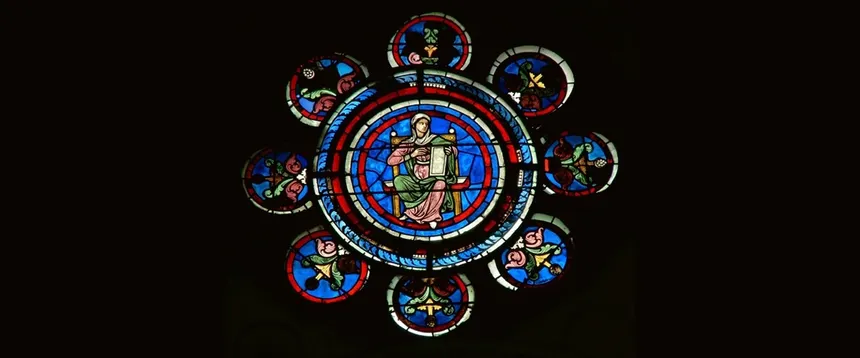

# testtitle

<div align='center'>
  
</div>

## testing subtitle

this [one](https://one.com) that [two](https://two.com) another [three](https://three.com)

```bash
sdssd-sd-sd--sd
```

<div align='center'>
  
</div>


## Flags

```bash
3435343********
```
## subtitle 2

one more

```bash
df-fdg-df-d-sdfd
```

<div align='center'>
  
</div>

- [Download profile.md](profile.md)
```bash
gfdghdsgds78fd**************
```

## Siguenos

<div align='center'>
  <p>Thanks for reading! Follow me on my socials:</p>
  <a href='https://x.com/@imahian'></a>
  <a href='https://discord.gg/dbesG8EX'></a>
  <a href='https://youtube.com/@imahian'></a>
  <a href='https://twitch.tv/imahian'></a>
</div>

---
