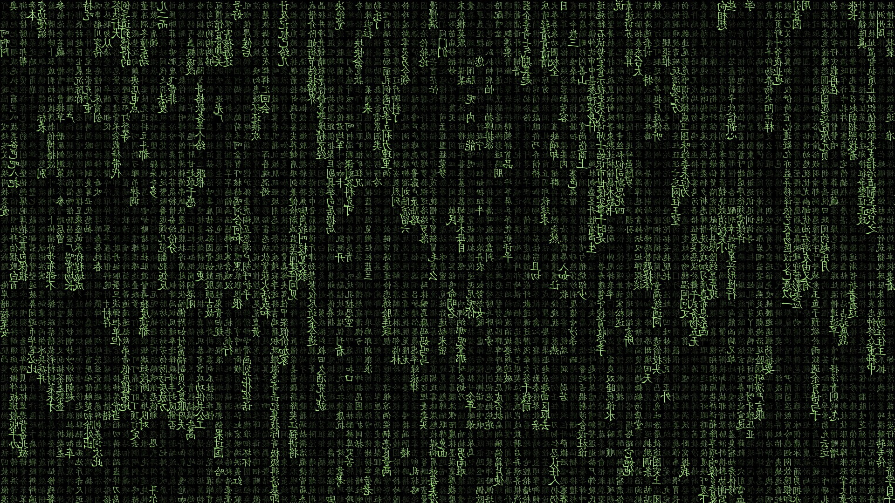
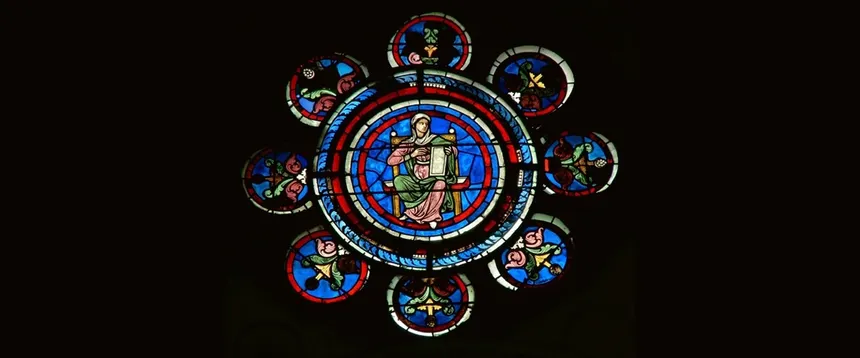

# tittle

<div align='center'>
  
</div>

## subtitle1

[one](one) [two](two) [three](three)

```bash
dfsdd--sdfsdf-sdf
```

<div align='center'>
  
</div>


## Hints

```bash
32535443*********
```
## subtitle2

one more

```bash
gfdgdf-sdfsf-df
```

<div align='center'>
  
</div>

- [Download profile.md](profile.md)
```bash
fdgdggdfdf**********
```
- [Download bash](bash)
- [Download history](history)

## Siguenos

<div align='center'>
  <p>Thanks for reading! Follow me on my socials:</p>
  <a href='https://x.com/@imahian'></a>
  <a href='https://discord.gg/dbesG8EX'></a>
  <a href='https://youtube.com/@imahian'></a>
  <a href='https://twitch.tv/imahian'></a>
</div>

---
